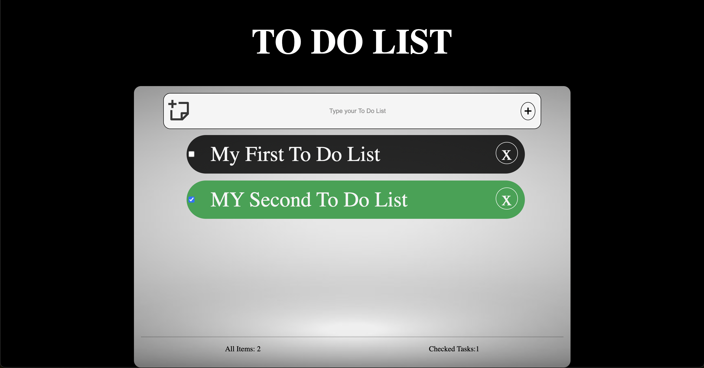

# To-Do-List

A simple Todo list with vanilla JS

## Features

1.A minimal design with HTML and CSS, it should look nice (no libraries, no frameworks).
2.A text box at the top to add a todo item to the list.
3.Add button: when a user clicks on the button, add that todo item to the list.
4.A delete button to delete the todo item completely from the list.
5.A checkbox to check the item off the list. (checked item should stay in the list, with some differentiation from rest of the todo items)

# screenshot

